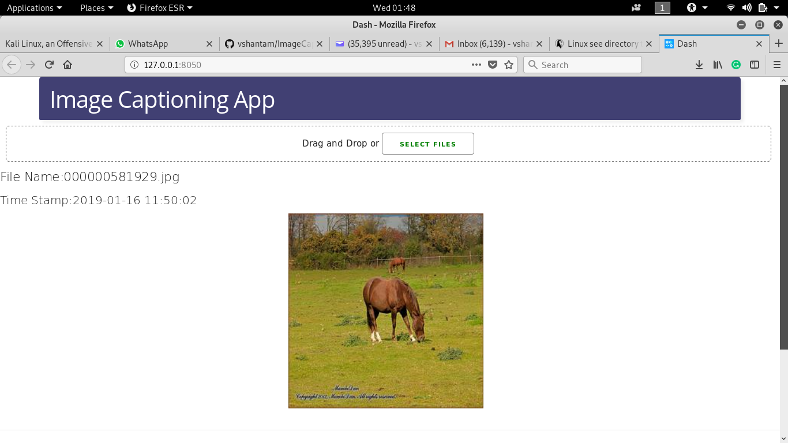
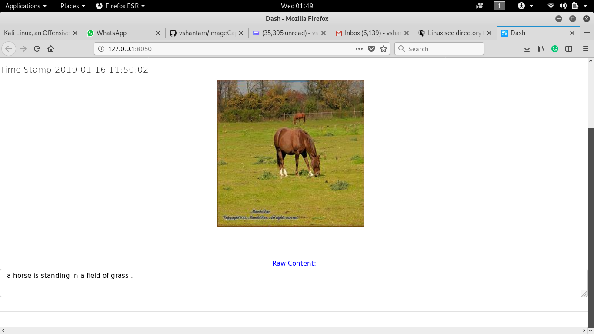
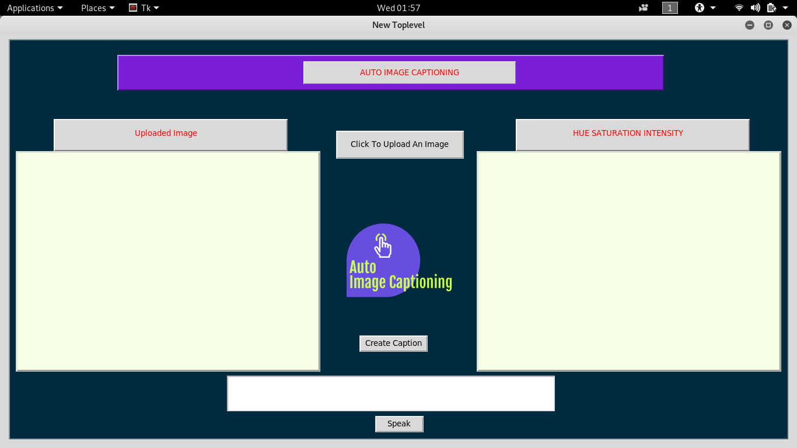
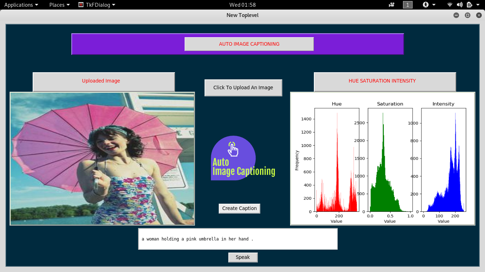

# Image Captioning
The goal of image captioning is to convert a given input image into a natural language description. The encoder-decoder framework is widely used for this task. The image encoder is a convolutional neural network (CNN). In this tutorial, we used [resnet-152](https://arxiv.org/abs/1512.03385) model pretrained on the [ILSVRC-2012-CLS](http://www.image-net.org/challenges/LSVRC/2012/) image classification dataset. The decoder is a long short-term memory (LSTM) network.


#### Training phase
For the encoder part, the pretrained CNN extracts the feature vector from a given input image. The feature vector is linearly transformed to have the same dimension as the input dimension of the LSTM network. For the decoder part, source and target texts are predefined. For example, if the image description is **"Giraffes standing next to each other"**, the source sequence is a list containing **['\<start\>', 'Giraffes', 'standing', 'next', 'to', 'each', 'other']** and the target sequence is a list containing **['Giraffes', 'standing', 'next', 'to', 'each', 'other', '\<end\>']**. Using these source and target sequences and the feature vector, the LSTM decoder is trained as a language model conditioned on the feature vector.

#### Test phase
In the test phase, the encoder part is almost same as the training phase. The only difference is that batchnorm layer uses moving average and variance instead of mini-batch statistics. This can be easily implemented using [encoder.eval()](https://github.com/yunjey/pytorch-tutorial/blob/master/tutorials/03-advanced/image_captioning/sample.py#L37). For the decoder part, there is a significant difference between the training phase and the test phase. In the test phase, the LSTM decoder can't see the image description. To deal with this problem, the LSTM decoder feeds back the previosly generated word to the next input. This can be implemented using a [for-loop](https://github.com/yunjey/pytorch-tutorial/blob/master/tutorials/03-advanced/image_captioning/model.py#L48).


## Directory Structure

    .
    ├── Articles
    │   └── 10833-Article Text-20198-1-10-20180216.pdf
    ├── build_vocab.py
    ├── cocoapi
    │   ├── common
    │   │   ├── gason.cpp
    │   │   ├── gason.h
    │   │   ├── maskApi.c
    │   │   └── maskApi.h
    │   ├── license.txt
    │   ├── LuaAPI
    │   │   ├── CocoApi.lua
    │   │   ├── cocoDemo.lua
    │   │   ├── env.lua
    │   │   ├── init.lua
    │   │   ├── MaskApi.lua
    │   │   └── rocks
    │   │       └── coco-scm-1.rockspec
    │   ├── MatlabAPI
    │   │   ├── CocoApi.m
    │   │   ├── cocoDemo.m
    │   │   ├── CocoEval.m
    │   │   ├── CocoUtils.m
    │   │   ├── evalDemo.m
    │   │   ├── gason.m
    │   │   ├── MaskApi.m
    │   │   └── private
    │   │       ├── gasonMex.cpp
    │   │       ├── gasonMex.mexa64
    │   │       ├── gasonMex.mexmaci64
    │   │       ├── getPrmDflt.m
    │   │       └── maskApiMex.c
    │   ├── PythonAPI
    │   │   ├── build
    │   │   │   ├── bdist.linux-x86_64
    │   │   │   ├── common
    │   │   │   │   └── maskApi.o
    │   │   │   ├── lib.linux-x86_64-3.7
    │   │   │   │   └── pycocotools
    │   │   │   │       ├── cocoeval.py
    │   │   │   │       ├── coco.py
    │   │   │   │       ├── __init__.py
    │   │   │   │       ├── _mask.cpython-37m-x86_64-linux-gnu.so
    │   │   │   │       └── mask.py
    │   │   │   └── temp.linux-x86_64-3.7
    │   │   │       └── pycocotools
    │   │   │           └── _mask.o
    │   │   ├── dist
    │   │   │   └── pycocotools-2.0-py3.7-linux-x86_64.egg
    │   │   ├── Makefile
    │   │   ├── pycocoDemo.ipynb
    │   │   ├── pycocoEvalDemo.ipynb
    │   │   ├── pycocotools
    │   │   │   ├── cocoeval.py
    │   │   │   ├── coco.py
    │   │   │   ├── __init__.py
    │   │   │   ├── _mask.c
    │   │   │   ├── mask.py
    │   │   │   ├── _mask.pyx
    │   │   │   └── _mask.so
    │   │   ├── pycocotools.egg-info
    │   │   │   ├── dependency_links.txt
    │   │   │   ├── PKG-INFO
    │   │   │   ├── requires.txt
    │   │   │   ├── SOURCES.txt
    │   │   │   └── top_level.txt
    │   │   └── setup.py
    │   ├── README.txt
    │   └── results
    │       ├── captions_val2014_fakecap_results.json
    │       ├── instances_val2014_fakebbox100_results.json
    │       ├── instances_val2014_fakesegm100_results.json
    │       ├── person_keypoints_val2014_fakekeypoints100_results.json
    │       └── val2014_fake_eval_res.txt
    ├── data
    │   ├── annotations
    │   │   ├── captions_train2014.json
    │   │   ├── captions_val2014.json
    │   │   ├── instances_train2014.json
    │   │   ├── instances_val2014.json
    │   │   ├── person_keypoints_train2014.json
    │   │   └── person_keypoints_val2014.json
    │   ├── resized2017
    │   ├── Test2017
    │   ├── train2017
    │   └── vocab.pkl
    ├── data_loader.py
    ├── Desktop_Ui
    │   ├── build_vocab.py
    │   ├── data_loader.py
    │   ├── fpgui.py
    │   ├── fpgui_support.py
    │   ├── fpgui_support.pyc
    │   ├── fpgui.tcl
    │   ├── images.png
    │   ├── model.py
    │   ├── __pycache__
    │   │   ├── build_vocab.cpython-37.pyc
    │   │   ├── fpgui_support.cpython-37.pyc
    │   │   └── model.cpython-37.pyc
    │   └── temp
    │       ├── index.jpeg
    │       ├── plot.png
    │       ├── resizeimg.jpg
    │       └── resizeimgplot.png
    ├── download.sh
    ├── Images
    │   ├── Architecture.png
    │   ├── Lstm.png
    │   ├── rnnsingleexplained.png
    │   └── rnnsingle.png
    ├── model.py
    ├── models
    │   ├── decoder-5-3000.pkl
    │   └── encoder-5-3000.pkl
    ├── Papers
    │   ├── my paper
    │   │   └── paper.pdf
    │   ├── shah2017.pdf
    │   ├── you2016.pdf
    │   └── zhang2018.pdf
    ├── png
    │   ├── example.png
    │   ├── image_captioning.png
    │   └── model.png
    ├── __pycache__
    │   ├── build_vocab.cpython-36.pyc
    │   ├── data_loader.cpython-36.pyc
    │   └── model.cpython-36.pyc
    ├── README.md
    ├── Reports
    │   └── PreReport.docx
    ├── requirements.txt
    ├── resize.py
    ├── train.py
    └── Ui
        ├── app.py
        ├── build_vocab.py
        ├── dash_reusable_components.py
        ├── data_loader.py
        ├── good.mp3
        ├── images
        │   ├── animated1.gif
        │   ├── default.jpg
        │   ├── images.jpeg
        │   ├── screenshot1.png
        │   └── screenshot2.png
        ├── model.py
        ├── __pycache__
        │   ├── build_vocab.cpython-36.pyc
        │   ├── build_vocab.cpython-37.pyc
        │   ├── dash_reusable_components.cpython-36.pyc
        │   ├── dash_reusable_components.cpython-37.pyc
        │   ├── model.cpython-36.pyc
        │   ├── model.cpython-37.pyc
        │   ├── utils.cpython-36.pyc
        │   └── utils.cpython-37.pyc
        ├── resize.py
        └── utils.py


## Usage

<b> Basic System Requirement for fine execution:</b>

    Intel Corei5-5th gen
    Nvidia GTX 1080
    CUDA 9.0
    Debian Based OS (In my case KALI LINUX)
    python3 or Ipython3
    Mozila Firefox (for running Web Based Ui)

<b> Follow the Process to setup the environment, considering the system is updated and if not use the following command:</b>

    sudo apt-get update && dist-upgrade

<b> Follow Steps:</b>

#### 1. Clone the repositories
```bash
$ git clone https://github.com/pdollar/coco.git
$ cd coco/PythonAPI/
$ make
$ python3 setup.py build
$ python3 setup.py install
$ cd ../../
$ git clone https://github.com/vshantam/ImageCaptioning
```

#### 2. Download the dataset

```bash
$ chmod a+x download.sh
$ ./download.sh
```

#### 3. Install requirements

Using pip3 version, if not installed use the following command:

    sudo apt-get install python3-pip3

```bash
$ pip3 install -r requirements.text
```

#### 4. Preprocessing

```bash
$ python3 build_vocab.py   
$ python3 resize.py
```

#### 5. Train the model

```bash
$ python3 train.py    
```
Now the model has been trained considering trained on GPU using CUDA 9.0(if available) or else cpu is also fine.In this process model has been trained upto 5 epochs and more than 4000+ steps and been stored in the model directory as named as encoder and decoder.

### 6. results

<B> Web Based UI </B>





<B> Desktop Based UI </B>




